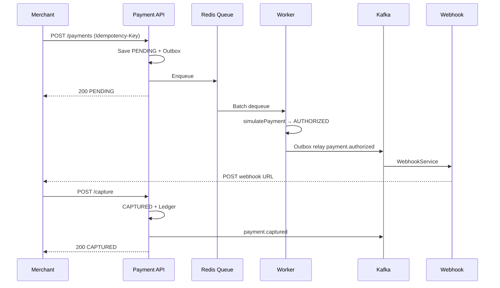

# Tài liệu yêu cầu nghiệp vụ (BA)
## Hệ thống thanh toán cho doanh nghiệp — Million Transaction

| Thuộc tính | Giá trị |
|---|---|
| Phiên bản | 2.0 |
| Cập nhật | 2026-08-29 |
| Trạng thái | Đồng bộ với triển khai hiện tại + mục tiêu kinh doanh |
| Đối tượng đọc | Product Owner, BA, Stakeholder |

---

## Mục lục

1. [Bối cảnh & mục tiêu](#1-bối-cảnh--mục-tieu)
2. [Stakeholder & người dùng](#2-stakeholder--người-dùng)
3. [User stories & trạng thái triển khai](#3-user-stories--trạng-thái-triển-khai)
4. [Quy tắc nghiệp vụ](#4-quy-tắc-nghiệp-vụ)
5. [Luồng nghiệp vụ chính](#5-luồng-nghiệp-vụ-chính)
6. [Ràng buộc & mục tiêu phi chức năng](#6-ràng-buộc--mục-tieu-phị-chức-năng)
7. [KPI & chỉ số thành công](#7-kpi--chỉ-số-thành-công)
8. [Rủi ro & giảm thiểu](#8-rủi-ro--giảm-thiểu)
9. [Lộ trình & ưu tiên](#9-lộ-trình--ưu-tiên)
10. [Tiêu chí nghiệm thu](#10-tiêu-chí-nghiệm-thu)

**Chú thích trạng thái:** ✅ Đã triển khai · ⚠️ Một phần · ❌ Chưa triển khai · 🎯 Mục tiêu kinh doanh

---

## 1. Bối cảnh & mục tiêu

### 1.1. Vấn đề kinh doanh

Doanh nghiệp cần tích hợp thanh toán vào website/app với khối lượng lớn, độ tin cậy cao, và thời gian tích hợp ngắn.

### 1.2. Mục tiêu kinh doanh

| Mục tiêu | Loại |
|---|---|
| Xử lý 1.000.000+ giao dịch/ngày | 🎯 Thiết kế hướng tới |
| Uptime 99.9% | 🎯 SLA mục tiêu |
| Giảm thời gian tích hợp từ 3 tháng → 1 tuần | 🎯 Kinh doanh |
| API phản hồi < 500ms (P95) | 🎯 SLA mục tiêu |
| Merchant tạo & theo dõi giao dịch qua REST API | ✅ Đã có |
| Idempotency chống trùng lặp | ✅ Đã có |
| Webhook thông báo trạng thái | ⚠️ Gửi được qua Kafka; REST cấu hình còn stub |

### 1.3. Phạm vi sản phẩm hiện tại

Hệ thống là **Payment Processing API** (Spring Boot), không phải payment gateway UI. Merchant tích hợp qua REST + JWT, xử lý authorization bất đồng bộ, capture/refund đồng bộ.

---

## 2. Stakeholder & người dùng

### 2.1. Stakeholder

| Nhóm | Nhu cầu chính |
|---|---|
| Merchant / Developer | API rõ ràng, idempotency, webhook, analytics |
| Finance / CS | Tra cứu giao dịch, ledger minh bạch |
| DevOps | Health check, Docker infra, monitoring |
| End customer | Trải nghiệm thanh toán qua merchant (gián tiếp) |

### 2.2. Personas

**Merchant Developer**
- Tích hợp `POST /payments` với `Idempotency-Key`
- Poll hoặc nhận webhook khi giao dịch `AUTHORIZED`
- Gọi capture khi giao hàng

**Internal Admin**
- Đăng nhập JWT, quản lý qua API
- User mặc định: `admin@example.com` (seed DB)

---

## 3. User stories & trạng thái triển khai

### 3.1. Quản lý giao dịch

#### US-01: Tạo giao dịch thanh toán ✅

> **Là** merchant, **tôi muốn** tạo giao dịch thanh toán **để** thu tiền từ khách hàng.

**Acceptance criteria (theo code):**
- [x] Gửi đủ thông tin → nhận mã giao dịch UUID, status `PENDING`
- [x] Giao dịch vào hàng đợi Redis xử lý authorization bất đồng bộ
- [x] Hỗ trợ USD, EUR, GBP, JPY (không có VND)
- [x] Idempotency key bắt buộc; trùng request trả kết quả cũ
- [x] Phản hồi đồng bộ trước khi authorization hoàn tất

**Quy tắc nghiệp vụ:**
- Số tiền tối thiểu: 0.01
- JPY: không có số thập phân
- Header `X-Merchant-ID` phải khớp body

---

#### US-02: Theo dõi trạng thái giao dịch ✅

> **Là** merchant, **tôi muốn** xem trạng thái giao dịch **để** cập nhật đơn hàng.

**Acceptance criteria:**
- [x] `GET /payments/{id}` trả đầy đủ trạng thái, số tiền, timestamp
- [x] `GET /payments` liệt kê theo merchant với phân trang
- [ ] Chỉ merchant sở hữu mới xem được *(chưa enforce trên GET by ID)*

---

#### US-03: Capture (thu tiền) ✅

> **Là** merchant, **tôi muốn** capture giao dịch đã authorized **để** thu tiền thực tế.

**Acceptance criteria:**
- [x] Chỉ capture khi `AUTHORIZED`
- [x] Hỗ trợ capture một phần (giữ status `AUTHORIZED` đến khi capture đủ)
- [x] Ghi ledger `CAPTURE`
- [x] Publish event `payment.captured`
- [ ] Gọi processor thực (Stripe) *(chưa — chỉ cập nhật DB)*

---

#### US-04: Hoàn tiền ✅

> **Là** merchant, **tôi muốn** hoàn tiền **để** xử lý yêu cầu trả hàng.

**Acceptance criteria:**
- [x] Refund khi `CAPTURED` hoặc `PARTIALLY_REFUNDED`
- [x] Hoàn toàn bộ hoặc một phần (amount bắt buộc trong request)
- [x] Idempotency key bắt buộc
- [x] Ghi ledger `REFUND`

---

#### US-05: Hủy giao dịch (Void) ❌

> **Là** merchant, **tôi muốn** hủy giao dịch authorized chưa capture **để** giải phóng ủy quyền.

**Trạng thái:** Domain có `CANCELLED` và ledger `VOID`, nhưng **chưa có API**. User story dự kiến Phase 2.

---

### 3.2. Sổ cái tài chính

#### US-06: Theo dõi dòng tiền ✅

> **Là** merchant, **tôi muốn** mọi thay đổi số tiền được ghi lại **để** đối soát.

**Acceptance criteria:**
- [x] Tự động ghi ledger khi authorization, capture, refund
- [x] Bút toán bất biến (không sửa/xóa qua API)
- [x] `balance_after` tính tuần tự theo `seq`
- [ ] API tra cứu ledger riêng *(chưa có endpoint)*

---

### 3.3. Idempotency

#### US-07: Chống giao dịch trùng lặp ✅

> **Là** merchant, **tôi muốn** gửi lại request an toàn khi mạng lỗi **để** không bị charge 2 lần.

**Acceptance criteria:**
- [x] Cùng key + cùng body → response cũ
- [x] Cùng key + khác body → lỗi 400
- [x] TTL theo loại thao tác (7/3/30 ngày DB; 24h Redis)
- [x] Phạm vi theo merchant

---

### 3.4. Webhook

#### US-08: Nhận thông báo tự động ⚠️

> **Là** merchant, **tôi muốn** nhận webhook khi trạng thái thay đổi **để** cập nhật hệ thống nội bộ.

**Đã triển khai:**
- [x] Gửi webhook qua Kafka consumer → `WebhookService`
- [x] HMAC-SHA256 signature (Base64)
- [x] Retry 3 lần, exponential backoff
- [x] Events: pending, authorized, captured, refunded, failed

**Chưa triển khai:**
- [ ] REST API cấu hình webhook thực (`WebhookController` là stub)
- [ ] Validate HTTPS URL trước khi lưu
- [ ] Dead letter queue cho webhook thất bại

---

### 3.5. Báo cáo & thống kê

#### US-09: Xem thống kê doanh thu ⚠️

> **Là** merchant, **tôi muốn** xem thống kê giao dịch **để** đánh giá hiệu quả.

**Acceptance criteria:**
- [x] `GET /analytics/payments` — query DB thực, cache 15 phút
- [x] Khoảng thời gian tối đa 90 ngày
- [x] totalVolume, successRate, statusBreakdown
- [ ] `GET /analytics/metrics` — **mock data**, chưa query thực
- [ ] Xuất Excel/PDF ❌

---

### 3.6. Quản lý tài khoản

#### US-10: Đăng ký & đăng nhập ✅

> **Là** developer nội bộ, **tôi muốn** đăng ký/đăng nhập **để** lấy JWT truy cập API.

**Acceptance criteria:**
- [x] Register với email, password, họ tên
- [x] Login trả JWT (7 ngày, HS512)
- [x] Password BCrypt
- [ ] Flow đăng ký merchant tự phục vụ ❌
- [ ] Xác thực email ❌
- [ ] Refresh token ❌

---

## 4. Quy tắc nghiệp vụ

### 4.1. Quy tắc số tiền & tiền tệ

| Quy tắc | Giá trị (code) |
|---|---|
| Số tiền tối thiểu | 0.01 |
| Tiền tệ hỗ trợ | USD, EUR, GBP, JPY |
| JPY | Không có phần thập phân |
| Khác | Tối đa 2 chữ số thập phân |

### 4.2. Máy trạng thái

```
PENDING → AUTHORIZED → CAPTURED → REFUNDED
                    ↘ FAILED
        AUTHORIZED → (partial capture) → AUTHORIZED → CAPTURED
        CAPTURED → PARTIALLY_REFUNDED → REFUNDED
        AUTHORIZED → CANCELLED  (API void chưa có)
```

| Chuyển trạng thái | Điều kiện |
|---|---|
| PENDING → AUTHORIZED | Authorization async thành công |
| PENDING → FAILED | Authorization async thất bại |
| AUTHORIZED → CAPTURED | Capture đủ `amount` |
| CAPTURED → REFUNDED | Refund đủ `capturedAmount` |
| CAPTURED → PARTIALLY_REFUNDED | Refund một phần |

### 4.3. Quy tắc thời gian

| Hạng mục | Giá trị |
|---|---|
| JWT token | 7 ngày |
| Idempotency Redis cache | 24 giờ |
| Idempotency DB (create/capture/refund) | 7 / 3 / 30 ngày |
| Analytics cache | 15 phút |
| Outbox relay | 5 giây |
| Payment batch processor | 1 giây |

### 4.4. Quy tắc bảo mật

| Quy tắc | Trạng thái |
|---|---|
| Tất cả API payment yêu cầu JWT | ✅ |
| Mật khẩu BCrypt | ✅ |
| Webhook HMAC signature | ✅ |
| Merchant chỉ xem giao dịch của mình | ⚠️ List có filter; GET by ID chưa |
| Rate limiting | ❌ |

---

## 5. Luồng nghiệp vụ chính

### 5.1. Luồng thanh toán tiêu chuẩn



### 5.2. Luồng hoàn tiền

1. Merchant gọi `POST /payments/{id}/refunds` với amount + Idempotency-Key
2. Hệ thống validate trạng thái và số tiền còn lại
3. Cập nhật `refundedAmount`, chuyển status
4. Ghi ledger REFUND, publish `payment.refunded`
5. Kafka consumer gửi webhook

---

## 6. Ràng buộc & mục tiêu phi chức năng

### 6.1. Hiệu suất

| Chỉ số | Mục tiêu 🎯 | Cơ chế hiện tại |
|---|---|---|
| 1M giao dịch/ngày | 🎯 | Redis queue + batch processor |
| 1000 concurrent writes | 🎯 | PaymentGuardService semaphore |
| API < 500ms P95 | 🎯 | Create trả ngay PENDING; auth async |
| Rate limit 1000 req/min | 🎯 | ❌ Chưa có |

### 6.2. Độ tin cậy

| Chỉ số | Mục tiêu 🎯 | Cơ chế hiện tại |
|---|---|---|
| Uptime 99.9% | 🎯 | Health checks, Docker infra |
| Không mất event | ✅ | Transactional Outbox |
| Master-Slave replication | ✅ | MySQL GTID, read routing |
| Backup hàng ngày | 🎯 | Chưa tự động hóa trong repo |

### 6.3. Bảo mật

| Yêu cầu | Trạng thái |
|---|---|
| JWT stateless | ✅ |
| HTTPS (production) | 🎯 Deployment responsibility |
| Audit log mọi thao tác | ⚠️ Application log + ledger |
| RBAC (ADMIN/USER) | ✅ Seed roles |

---

## 7. KPI & chỉ số thành công

### 7.1. KPI kinh doanh 🎯

| KPI | Mục tiêu |
|---|---|
| Merchants đăng ký năm 1 | 1.000 |
| Retention 6 tháng | 90% |
| Volume | 1M giao dịch/ngày |
| Tỷ lệ thành công | 98% |
| Thời gian tích hợp | < 1 tuần |

### 7.2. KPI kỹ thuật (đo được từ hệ thống)

| KPI | Nguồn đo |
|---|---|
| API uptime | Actuator + `/health/detailed` |
| Outbox lag | Health detailed |
| Kafka consumer lag | Kafka UI / monitoring |
| Success rate | `/analytics/payments` |
| Idempotency hit rate | Redis/DB metrics (custom) |

---

## 8. Rủi ro & giảm thiểu

| Rủi ro | Mức | Giảm thiểu hiện tại |
|---|---|---|
| Mất event Kafka | Cao | Transactional Outbox |
| Trùng charge | Cao | Idempotency 2 tầng |
| Slave lag ảnh hưởng analytics | Trung bình | Cache 15 phút; chấp nhận eventual consistency |
| Webhook REST stub | Trung bình | Delivery thực qua Kafka; cần wire controller |
| Stripe simulate luôn success | Trung bình | Cần tích hợp Stripe thật trước production |
| GET payment không check merchant | Trung bình | Cần bổ sung authorization check |
| Không có rate limit | Trung bình | Cần bổ sung trước go-live |

---

## 9. Lộ trình & ưu tiên

### Phase 1 — Core (✅ Hoàn thành)

- Tạo / tra cứu / liệt kê payment
- Async authorization qua Redis queue
- Capture / Refund + Ledger
- Idempotency
- Outbox → Kafka
- JWT auth
- Analytics cơ bản (`/analytics/payments`)
- Docker infra (MySQL, Redis, Kafka)

### Phase 2 — Hoàn thiện nghiệp vụ (Đang thiếu)

- [ ] API Void payment
- [ ] Wire WebhookController → WebhookService
- [ ] Analytics `/metrics` query DB thật
- [ ] Merchant isolation trên GET payment
- [ ] Stripe integration thực cho auth/capture/refund

### Phase 3 — Scale & Production 🎯

- [ ] Rate limiting
- [ ] Monitoring & alerting đầy đủ
- [ ] Load test 1M txn/day
- [ ] Backup & DR automation
- [ ] Multi-currency mở rộng (VND, ...)

---

## 10. Tiêu chí nghiệm thu

### 10.1. Chức năng cốt lõi

| Tiêu chí | Trạng thái |
|---|---|
| Merchant tạo giao dịch, nhận PENDING ngay | ✅ |
| Authorization bất đồng bộ → AUTHORIZED/FAILED | ✅ |
| Capture / Refund đúng business rules | ✅ |
| Ledger ghi đầy đủ | ✅ |
| Idempotency hoạt động | ✅ |
| Webhook gửi khi có event | ✅ |
| Analytics `/payments` chính xác | ✅ |

### 10.2. Phi chức năng

| Tiêu chí | Trạng thái |
|---|---|
| JWT auth | ✅ |
| Master-Slave routing | ✅ |
| Health check DB/Redis/Kafka | ✅ |
| Uptime 99.9% | 🎯 Cần load test & prod |
| Rate limiting | ❌ |

### 10.3. Trải nghiệm tích hợp

| Tiêu chí | Trạng thái |
|---|---|
| Swagger UI tài liệu API | ✅ |
| Docker one-command infra | ✅ |
| Idempotency header rõ ràng | ✅ |
| Webhook cấu hình qua API | ⚠️ Stub |

---

**Tài liệu liên quan:**
- [Yêu cầu chức năng](./TÀI_LIỆU_YÊU_CẦU_CHỨC_NĂNG.md)
- [Yêu cầu chi tiết kỹ thuật](./REQUIREMENTS_CHI_TIẾT.md)

---

**Phê duyệt:**

| Vai trò | Tên | Ngày |
|---|---|---|
| Business Owner | | |
| Product Manager | | |
| Tech Lead | | |
